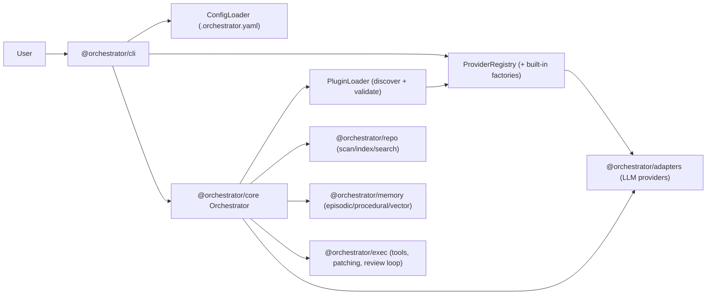

# Architecture

This document describes the high-level architecture of the Orchestrator system.

See `docs/architecture-invariants.md` for the rules we try to enforce across packages (dependency
direction, public API boundaries, lifecycle/shutdown, and observability).

## Overview

The Orchestrator is a modular monorepo designed to keep core orchestration logic independent from
I/O, provider SDKs, and CLI concerns. Most features are implemented as composable services with
explicit boundaries between packages.

## Package Responsibilities

| Package                    | Description                                                                              |
| :------------------------- | :--------------------------------------------------------------------------------------- |
| **@orchestrator/cli**      | The entry point for the command-line interface. Handles user input and commands.         |
| **@orchestrator/core**     | Contains the core domain entities and business logic independent of external frameworks. |
| **@orchestrator/exec**     | The execution engine responsible for running workflows and tasks.                        |
| **@orchestrator/eval**     | Handles evaluation strategies, potentially for analyzing outputs or making decisions.    |
| **@orchestrator/memory**   | Manages long-term memory, context, and state persistence.                                |
| **@orchestrator/repo**     | The repository layer, abstracting file system and database access.                       |
| **@orchestrator/adapters** | Adapters for integrating with external tools, APIs, or services.                         |
| **@orchestrator/shared**   | Common utilities, types, and helpers used across multiple packages.                      |

## Dependency Direction (intended)

Most dependencies should flow “up” toward the CLI:

`shared` → (`repo`, `adapters`, `plugin-sdk`) → (`memory`, `exec`) → `core` → `cli`

Notes:

- `@orchestrator/shared` should not depend on any other workspace packages.
- `@orchestrator/plugin-sdk` defines stable plugin-facing types and utilities and should remain
  minimally coupled (primarily depends on `shared`).
- `@orchestrator/core` is allowed to compose across packages, but should avoid leaking internal
  implementation details across its public API.

## Data Flow (high level)

### Typical `orchestrator run`

### In more detail

1. **CLI** parses flags, finds repo root, loads config, and creates a `ProviderRegistry`.
2. **Registry** is seeded with built-in adapter factories (OpenAI, Anthropic, local CLIs, etc.).
3. **Core** creates an `Orchestrator` and loads plugins (if enabled) from configured paths.
   - Provider plugins are registered into the same registry as additional adapter factories.
4. **Core orchestration loop** plans (optional), builds context, requests candidates, evaluates them,
   applies patches, and runs verification.
5. **Repo/Exec/Memory** are consulted throughout for scanning, indexing, tool execution, and state.
6. **Adapters** are the only place that talks to external LLM APIs / local provider CLIs.

## Adding a New Package

When adding a new package:

1. Determine if the functionality belongs in an existing package or requires a new domain boundary.
2. Follow the `@orchestrator/<name>` naming convention.
3. Ensure strict dependency boundaries (e.g., `shared` should not depend on `cli`).
